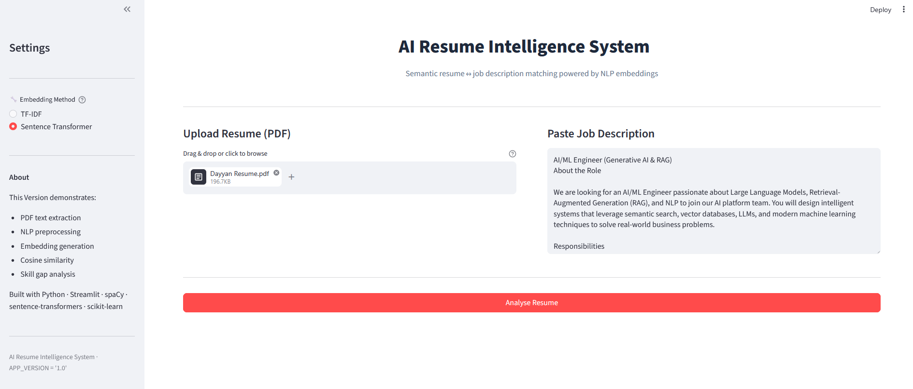
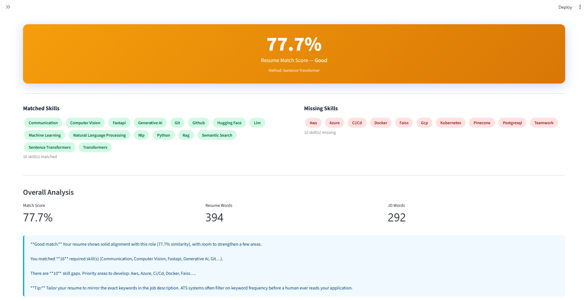

# 🧠 AI Resume Intelligence System

A local Streamlit application that scores how well a resume (PDF) matches a job description using classical and neural NLP techniques, then reports the specific skills that are matched or missing.

---

# Features

- 📄 **PDF resume upload** — text extraction via PyPDF2, page by page, with per-page error tolerance.
- 💼 **Job description input** — free-text paste box (minimum 50 characters enforced).
- 🔤 **NLP preprocessing pipeline** — URL/email stripping, special-character removal, tokenization, English stopword removal, spaCy lemmatization.
- 🔢 **Two selectable embedding methods** — TF-IDF (unigram + bigram, sparse, scikit-learn) or Sentence-Transformer dense embeddings (`all-MiniLM-L6-v2`), chosen via a sidebar radio.
- 📐 **Cosine similarity scoring** — a single 0–100% match score, clipped to a valid range, with a text label (Excellent / Good / Fair / Weak).
- 🧩 **Skill extraction and gap analysis** — a curated ~100-term vocabulary matched against both documents with whole-word regex, producing matched and missing skill sets.
- 📝 **Auto-generated recommendation** — a multi-paragraph, score-and-gap-aware message with an ATS keyword-matching tip.
- 🎨 **Custom-styled UI** — gradient score card, colored skill pills, metrics row, injected CSS, all rendered through dedicated UI components.
- 🔍 **Transparency panels** — expandable views of the raw extracted resume text and the preprocessed (cleaned) resume text.

Not implemented (see **Limitations**): DOCX/OCR support, multi-resume batch scoring, persistence, authentication, and deployment configuration.

---

# Architecture

The project is a single-page Streamlit app split into one module per pipeline stage, following separation of concerns: each file owns exactly one responsibility (I/O, cleaning, vectorization, scoring, domain logic, or presentation), and `app.py` is the only module that sequences them together.

- **`app.py`** — Entry point. Configures the Streamlit page, injects CSS, lays out the two-column input UI, and on button click runs the full pipeline in order: validate → extract → preprocess → embed → score → analyze skills → render.
- **`parser.py`** — PDF → raw text. Wraps PyPDF2, iterating pages defensively so a single corrupt page doesn't fail the whole extraction. Also exposes `extract_text_from_string`, a plain passthrough helper (currently unused by `app.py`).
- **`preprocess.py`** — Raw text → cleaned token string. Regex-based URL/email/punctuation stripping, lowercasing, whitespace tokenization, NLTK stopword filtering, and spaCy (`en_core_web_sm`) lemmatization. Downloads NLTK's `stopwords`/`punkt` corpora and the spaCy model automatically on first run if missing.
- **`embeddings.py`** — Cleaned text → vector(s). Two independent strategies behind one interface: `get_tfidf_embeddings` (fits a fresh `TfidfVectorizer` on the resume+JD pair each call) and `get_transformer_embeddings` (encodes both texts with a lazily-loaded, module-level singleton `SentenceTransformer`).
- **`similarity.py`** — Vector pair → score. `compute_cosine_similarity` wraps scikit-learn's `cosine_similarity`, reshapes inputs, and clips the result to `[0, 1]`. `interpret_score` maps a percentage to a human label.
- **`analysis.py`** — Text → skill sets → recommendation. Holds the hardcoded `SKILL_VOCABULARY` list, does whole-word regex matching against raw (non-preprocessed) text to preserve multi-word phrases like "machine learning", computes matched/missing sets, and builds the final recommendation string from the score bucket and gap counts.
- **`ui.py`** — Pure rendering. Header, sidebar (embedding-method selector + about box), the gradient score card, skill-pill sections, and the metrics/recommendation summary block. Contains no pipeline logic — it only reads values `app.py` passes in, plus `interpret_score` from `similarity.py`.
- **`utils.py`** — Cross-cutting helpers: `validate_inputs` (used by `app.py`), `log_info` (used throughout for timestamped console logging). `truncate_text` and `percentage_overlap` are defined but not currently called anywhere in the pipeline — dead code left in for future use.

This modularity means each stage can be tested, replaced, or extended independently — e.g., swapping the embedding backend or vocabulary doesn't require touching the PDF parser or the UI.

---

# Project Structure

```
AI Resume System/
├── app.py              # Streamlit entry point — orchestrates the pipeline
├── parser.py            # PDF text extraction (PyPDF2)
├── preprocess.py         # Cleaning, tokenization, stopwords, lemmatization
├── embeddings.py         # TF-IDF and Sentence-Transformer embedding generation
├── similarity.py         # Cosine similarity + score-to-label mapping
├── analysis.py           # Skill vocabulary, extraction, gap analysis, recommendation text
├── ui.py                 # Streamlit rendering components (header, sidebar, cards, pills)
├── utils.py              # Input validation, logging, misc helpers
├── requirements.txt       # Pinned minimum dependency versions
└── README.md
```

All modules live at the project root and import each other directly (`from parser import extract_text_from_pdf`, etc.) — there is no `src/` package layout in the actual code, and no `data/`, `sample_resumes/`, or `screenshots/` directories exist in the repository at this time.

---

# Pipeline

```
Resume PDF + Job Description
            │
            ▼
   Input Validation (utils.validate_inputs)
            │
            ▼
   PDF Text Extraction (parser.extract_text_from_pdf)
            │
            ▼
   Text Preprocessing (preprocess.preprocess_text)
   — run separately on resume text and JD text
            │
            ▼
   Embedding Generation (embeddings.py)
   — TF-IDF  OR  Sentence-Transformer, per sidebar selection
            │
            ▼
   Cosine Similarity (similarity.compute_cosine_similarity)
            │
            ▼
   Skill Extraction (analysis.extract_skills)
   — run on RAW resume/JD text, not the preprocessed version
            │
            ▼
   Skill Gap Analysis (get_matched_skills / get_missing_skills)
            │
            ▼
   Recommendation Generation (analysis.generate_recommendation)
            │
            ▼
   UI Rendering (ui.py: score card, skill pills, metrics, recommendation box)
```

**Validation** rejects the request early if no file was uploaded, the job description is empty, or it's under 50 characters — avoiding wasted embedding computation on incomplete input.

**PDF extraction** reads the uploaded file's bytes into memory and hands them to PyPDF2's `PdfReader`, concatenating `extract_text()` output per page; any page that raises an exception is skipped and logged, not fatal.

**Preprocessing** is applied twice — once to the resume, once to the JD — using the identical function, so both texts go through the same normalization before vectorization.

**Embedding generation** branches on the sidebar's radio selection. TF-IDF fits a new vectorizer on the two documents together (so the vocabulary spans both), while the transformer path reuses one cached `SentenceTransformer` instance and encodes both texts as a single batch with `normalize_embeddings=True` (so cosine similarity reduces to a dot product).

**Cosine similarity** is computed on whichever vector pair was produced, reshaped to 2D for scikit-learn's API, and clipped into `[0, 1]` before being turned into a percentage.

**Skill extraction** runs independently of the embedding step, on the *raw* (not lemmatized/stopword-stripped) text, so multi-word vocabulary entries like "sentence transformers" or "reinforcement learning" can still be matched as phrases via word-boundary regex.

**Recommendation generation** stitches together four parts — a score-bucketed opening line, a matched-skills summary, a missing-skills summary (phrased differently depending on how many are missing), and a static ATS tip — into one Markdown string.

**UI rendering** is the only place output touches the screen: the score card's gradient color is chosen from the same score buckets as the recommendation text, skill pills are colored green/red by set membership, and word counts are shown via `st.metric`.

---

# Technologies Used

**Programming Language**
- Python 3 (uses `list[str]`, `tuple[...]`, `X | None` syntax — requires 3.10+)

**Frameworks**
- Streamlit — UI and app runtime

**Machine Learning**
- scikit-learn — `TfidfVectorizer`, `cosine_similarity`
- sentence-transformers — `all-MiniLM-L6-v2` pretrained model

**NLP**
- spaCy (`en_core_web_sm`) — lemmatization
- NLTK — English stopword corpus

**Vector Search**
- None implemented — similarity is computed directly between two vectors at request time; there is no index or vector store.

**UI**
- Streamlit widgets (file uploader, text area, radio, columns, metrics, expanders) with injected custom CSS

**Utilities**
- NumPy — vector reshaping/clipping
- PyPDF2 — PDF parsing
- Python `re`, `datetime`, `io` (standard library)

**Developer Tools**
- `requirements.txt` for dependency pinning
- Git (repository present)

---

# Machine Learning Concepts

- **Tokenization** — splitting normalized text into individual word units. Done here with a simple `str.lower().split()` in `preprocess.py`, which is what feeds every downstream NLP step.
- **Stopword Removal** — discarding high-frequency, low-information words (e.g., "the", "and") using NLTK's English list, so vectors and skill matching focus on content-bearing words.
- **Lemmatization** — reducing words to their dictionary base form (e.g., "developing" → "develop") via spaCy, so that morphological variants of the same skill or concept aren't treated as distinct tokens by TF-IDF.
- **TF-IDF (Term Frequency–Inverse Document Frequency)** — a sparse, count-based vector representation that weights a word by how often it appears in a document versus how common it is across the corpus. Used here as the fast, keyword-driven embedding option; includes bigrams so short phrases contribute too.
- **Sparse vs. Dense vectors** — TF-IDF vectors are sparse (mostly zeros, one dimension per vocabulary term, size depends on the two documents' combined vocabulary) and only capture lexical overlap. Sentence-Transformer vectors are dense, fixed-length (384-dim for MiniLM), and encode semantic meaning, so paraphrased or synonym-based matches score higher than TF-IDF would give them credit for.
- **Sentence Transformers / Embeddings** — `all-MiniLM-L6-v2` maps a full text into a single dense vector such that texts with similar meaning are close in vector space, which is why it's offered as the "semantic" alternative to TF-IDF.
- **Semantic Search** — the underlying principle that makes the transformer path more forgiving of vocabulary mismatch than TF-IDF; only a two-document comparison is done here, not a search over many candidates.
- **Cosine Similarity** — measures the angle between two vectors regardless of magnitude, which is why it's the standard metric for comparing both sparse TF-IDF vectors and normalized transformer embeddings; used as the single scalar "match score" for the whole app.
- **Skill/Entity extraction (rule-based)** — not a trained model here, but a deterministic regex-over-vocabulary approach; explained under Design Decisions and Limitations below.

---

# Project Workflow

What happens after the user clicks **🔍 Analyse Resume**:

1. `validate_inputs` checks that a PDF was uploaded and the job description is present and at least 50 characters; on failure, an `st.error` is shown and execution stops.
2. Inside a `st.spinner` block, `extract_text_from_pdf` reads the uploaded file and returns concatenated page text; if extraction yields nothing, an error is shown and the run stops.
3. `preprocess_text` is called once on the resume text and once on the job description text.
4. Based on the sidebar's `embedding_method` value, either `get_tfidf_embeddings` or `get_transformer_embeddings` is called on the two cleaned strings.
5. `compute_cosine_similarity` turns the vector pair into a single similarity score, converted to a rounded percentage.
6. `extract_skills` runs on the *original* (non-preprocessed) resume and JD text; `get_matched_skills` and `get_missing_skills` compute set intersection/difference.
7. `generate_recommendation` builds the final Markdown recommendation from the score and the two skill lists.
8. Results render: a success banner, the gradient score card (`render_score_card`), two columns of skill pills (`render_skills_section`), a metrics + recommendation block (`render_analysis_summary`), and two collapsible expanders showing the raw and cleaned resume text for transparency.

---

# Design Decisions

- **Modularity / Separation of Concerns** — each file maps to exactly one pipeline stage (parsing, cleaning, embedding, scoring, domain analysis, presentation). This keeps `app.py` readable as a sequence of named calls rather than an inline script.
- **Single Responsibility Principle** — e.g., `similarity.py` only ever computes a score and labels it; it has no knowledge of PDFs, skills, or UI. `ui.py` only renders values it's given.
- **Reusable Components** — `preprocess_text` is applied identically to both the resume and the JD; `render_skills_section` is called twice (once for matched, once for missing) with a `kind` flag instead of duplicated rendering code.
- **Loose Coupling** — modules communicate through plain function arguments and return values (strings, sets, `np.ndarray`, floats) rather than shared global state, so any module can be swapped (e.g., a different embedding model) without changing its callers' signatures.
- **High Cohesion** — related logic is grouped together, e.g., all skill-vocabulary matching and recommendation-text generation lives in `analysis.py` rather than being scattered across the UI or main script.
- **Trade-off — dual embedding methods** — offering both TF-IDF and Sentence-Transformer means the user can trade speed (TF-IDF is near-instant) for semantic quality (transformer is slower on first load, since the ~80MB model downloads then loads into memory), rather than the app forcing one approach.
- **Trade-off — rule-based skill extraction** — a hardcoded vocabulary with regex matching is simple, fast, fully deterministic, and requires no additional model or training data, but it can only ever recognize terms already in the list — it will not generalize to a skill it hasn't seen written exactly that way.
- **Trade-off — skills matched on raw text, similarity computed on cleaned text** — this is intentional: lemmatization/stopword removal helps TF-IDF/embedding quality, but would break exact multi-word skill phrases (e.g., stripping would turn "machine learning" into "machine learn"), so `extract_skills` deliberately runs on the untouched text instead.

---

# Limitations

- **Static skill vocabulary** — `SKILL_VOCABULARY` in `analysis.py` is a fixed, hardcoded list; any skill or technology not on it will never be detected as matched or missing.
- **No DOCX support** — `parser.py` only implements PDF extraction via PyPDF2; other resume formats are not handled.
- **No OCR** — PyPDF2 extracts embedded text layers only; a scanned/image-only PDF will yield an empty string and trigger the "could not extract text" error.
- **No database or persistence** — nothing is saved between runs; every analysis is recomputed from scratch and lost on refresh.
- **No authentication or user accounts** — the app has no login or session separation; it's a single-user local tool.
- **No deployment configuration** — there is no Dockerfile, CI config, or cloud deployment setup in the repository; it runs only via `streamlit run app.py` locally.
- **Single resume vs. single JD only** — there is no batch mode to compare multiple resumes against one job description or vice versa.
- **Some utility code is unused** — `utils.truncate_text`, `utils.percentage_overlap`, and `parser.extract_text_from_string` are defined but never called by `app.py`'s current pipeline.
- **TF-IDF vocabulary is call-scoped** — the vectorizer is refit on just the resume+JD pair each time, so TF-IDF scores aren't comparable across different analysis runs (each run defines its own vocabulary).

---

# Future Improvements

- **Docker** — packaging the app (plus the spaCy/NLTK/sentence-transformer model downloads) into an image would make setup reproducible and remove "works on my machine" first-run download friction.
- **Cloud Deployment** — hosting on a platform like Streamlit Community Cloud, Render, or a container service would let the tool be used without a local Python environment.
- **Learned Skill Extraction** — replacing or augmenting the static vocabulary with a trained NER/keyword-extraction model would let the system recognize skills it currently has no entry for.
- **OCR Integration** — adding an OCR fallback (e.g., Tesseract) for scanned PDFs would remove the current text-based-PDF-only constraint.
- **Resume Ranking / Batch Processing** — extending the pipeline to score many resumes against one JD (or vice versa) would support a recruiter-facing use case rather than just a single self-check.
- **Vector Database Integration** — storing embeddings in something like FAISS, Chroma, or Pinecone would enable fast similarity search across many stored resumes instead of one-off pairwise comparison.
- **LLM-Generated Feedback** — using an LLM to turn the matched/missing skill lists into more specific, natural-language rewrite suggestions than the current templated recommendation text.
- **Persistence Layer** — a lightweight database (SQLite/Postgres) to store past analyses so users can track how a resume's match score changes over time.

---

# Installation

### 1. Clone the repository
```bash
git clone <your-repo-url>
cd "AI Resume System"
```

### 2. Create and activate a virtual environment
```bash
python -m venv .venv
source .venv/bin/activate      # Linux / macOS
.venv\Scripts\activate         # Windows
```

### 3. Install dependencies
```bash
pip install -r requirements.txt
```

### 4. Download the spaCy language model
```bash
python -m spacy download en_core_web_sm
```
(`preprocess.py` also attempts to download this automatically at runtime if it's missing, but doing it upfront avoids a slow first analysis.)

### 5. Run the app
```bash
streamlit run app.py
```
Then open the URL Streamlit prints (typically `http://localhost:8501`).

> Note: the Sentence-Transformer model (`all-MiniLM-L6-v2`, ~80MB) downloads automatically the first time you select that embedding method.

---

# Screenshots


| Input Screen | Results Screen |
|---|---|
||  |

---

# License

MIT